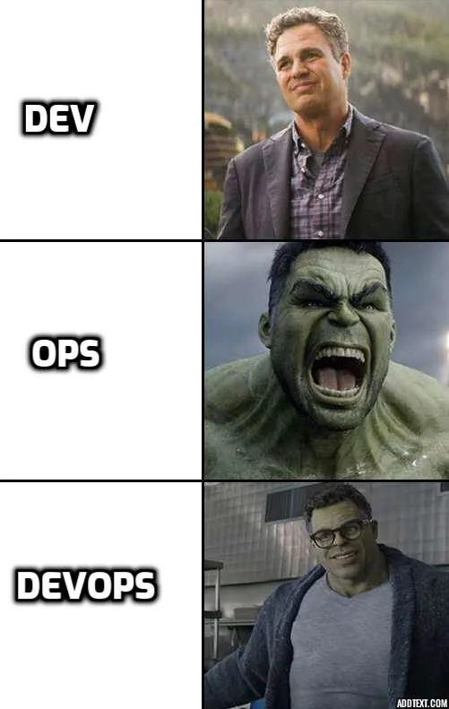

# vagrant-kube-cilium

# Why this way?
Just to learn vagrant and manual kubernetes setup.

# What's included?
CNI - Cilium (https://docs.cilium.io/en/stable/cheatsheet/)

# Future plans
- Add ansible, puppet and more.

# Quick start alternatives
kind (https://kind.sigs.k8s.io/)
k3s (https://k3s.io/) - My favourite due to the size and performance
minikube (https://github.com/kubernetes/minikube) (https://minikube.sigs.k8s.io/docs/)